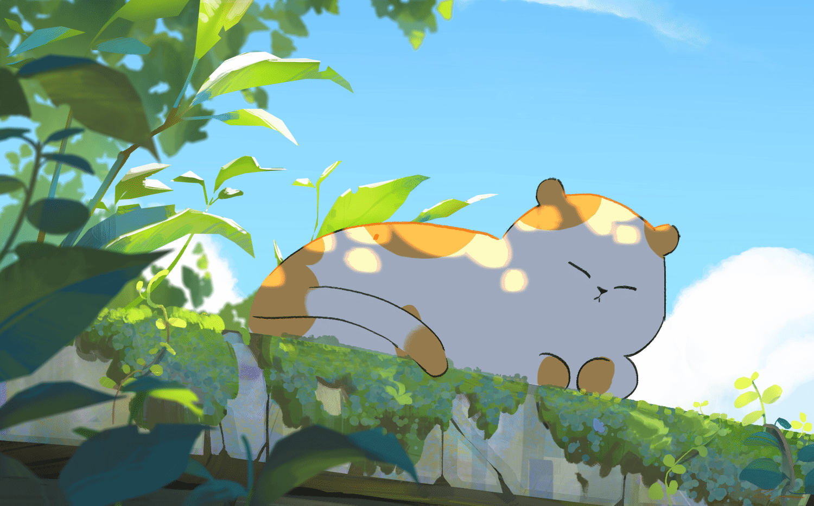
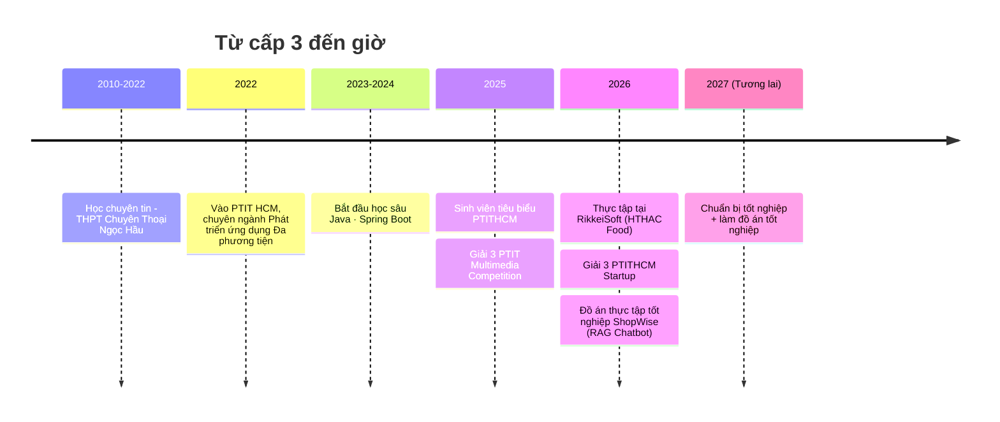
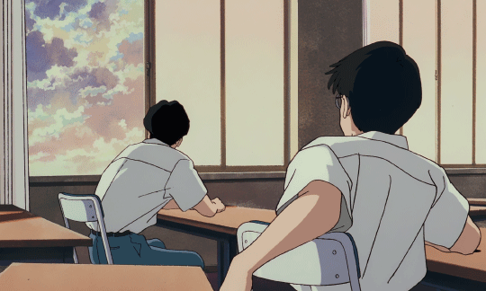

 

# ☀️ Phạm Nguyễn  Hải Triều (Aftanoon)

### `Software Engineering` · Backend Developer · Long Xuyên, Việt Nam

  

 

<table width="100%">
<tr>
<td width="60%" valign="top">

## 🌿 Vài dòng

Mình tên là Hải Triều (bạn có thể gọi mình là Bảo cũng  được). Hiện đang là sinh viên năm cuối chuyên ngành Phát triển ứng dụng Đa phương tiện, lĩnh vực theo đuổi của mình là Backend.
Tuy đang cố gắng trau dồi kiến thức backend, mình luôn muốn trở thành 1 fullstack developer chuyên nghiệp.

Vừa kết thúc kì thực tập, hiện đang chuẩn bị làm đồ án tốt nghiệp - Nói chung là chill😐

**Status:** đang chuẩn bị tốt nghiệp + rải CV  
**Đang ngâm cứu:** Devops, Eureka, Kafka, API Gateway  
**English:** đọc hiểu cơ bản, giao tiếp chút chút (TOEIC LR 870)

</td>
<td width="40%" valign="top" align="center">

<i>tinh thần làm việc mỗi khi 3h chiều</i>

</td>
</tr>
</table>

 

## 🍃 Kỹ năng & thành tựu

<table width="100%" cellspacing="20">
<tr>
<td width="50%" valign="top" style="border: 1px solid #ccc; padding: 20px; border-radius: 6px;">

### 🍃 Kỹ năng

<table style="margin: 0 auto;">
<tr>
<td width="18%"><b>Ngôn ngữ chính</b></td>
<td></td>
</tr>
<tr>
<td><b>Mở rộng</b></td>
<td></td>
</tr>
<tr>
<td><b>Microservices</b></td>
<td></td>
</tr>
<tr>
<td><b>Database</b></td>
<td></td>
</tr>
<tr>
<td><b>Tools</b></td>
<td></td>
</tr>
</table>

Spring Security · Spring JPA · JWT · Eureka · API Gateway

</td>
<td width="50%" valign="top" style="border: 1px solid #ccc; padding: 20px; border-radius: 6px;">

### 🌻 Vài cột mốc

| | |
|:---:|---|
| 🎓 | Học bổng khuyến khích học tập tất cả học kì |
| 🌟 | Sinh viên tiêu biểu PTITHCM năm học 2024-2025 |
| 🥉 | Giải 3 · PTIT Multimedia Competition |
| ✨ | Giải Triển vọng · ITMC TechSolve — Ứng dụng Stari |
| 🥉 | Giải 3 · PTITHCM Startup — Ứng dụng OptiGo |

</td>
</tr>
</table>

 

## 🏆 Đồ án Thực tập Tốt nghiệp

<table width="100%">
<tr>
<td width="100%" valign="top">

### 🛒 ShopWise — Website bán đồ điện tử + Chatbot tư vấn RAG

Website thương mại điện tử bán điện thoại/laptop/phụ kiện, tích hợp **chatbot tư vấn dùng RAG** — không trả lời bừa mà truy xuất đúng dữ liệu sản phẩm thật rồi mới sinh câu trả lời (Hybrid Search: dense embedding + BM25, có PhoBERT nhận diện ý định, off-topic gate để chặn câu hỏi ngoài phạm vi).

Hệ thống tách 3 service độc lập: **Frontend** (Next.js 16 + React 19), **Backend nghiệp vụ** (Spring Boot 4 — phần mình phụ trách: Auth, Catalog, Cart, Order, Payment, Voucher...), **AI Service** (FastAPI + Gemini). Database dùng PostgreSQL/Supabase với `pgvector` để lưu vector luôn, không cần dựng thêm vector DB riêng.

        

 

</td>
</tr>
</table>

 

## 💻 Dự án khác

<table width="100%">
<tr>
<td width="50%" valign="top">

**🖼️ Deblur Card — Computer Vision**

Dùng NAFNet để khử mờ ảnh thẻ (chữ + hình), khôi phục lại độ nét để đọc được thông tin trên thẻ bị mờ.

 

</td>
<td width="50%" valign="top">

**✅ Task Management — Full-stack**

App quản lý công việc/dự án kiểu Kanban cho cá nhân & team. **Vai trò:** thiết kế DB schema với Sequelize ORM, xây REST API bảo mật (JWT auth, bcrypt, rate limiting, Helmet), CRUD task/project, API thống kê, xuất báo cáo Excel.

     

</td>
</tr>
<tr>
<td width="50%" valign="top">

**🥘 FoodNote App — Android**

App offline quản lý công thức nấu ăn, "tủ lạnh ảo" theo dõi nguyên liệu, tự sinh danh sách mua sắm. **Vai trò:** thiết kế database local (Room) với quan hệ công thức–nguyên liệu, dựng UI chính (Fragments, ViewPager2, RecyclerView adapters) & luồng điều hướng.

  

</td>
<td width="50%" valign="top">

**📋 Internship Management System (IMS) — RESTful API**

Backend số hóa & tự động hóa quy trình quản lý thực tập, kết nối 3 vai trò **Admin · Mentor · Student**. Quy mô **40+ RESTful API**: quản lý người dùng/phân quyền (RBAC), thiết lập giai đoạn thực tập, cấu hình động các đợt đánh giá với **trọng số tùy chỉnh**, phân công mentor–sinh viên, chấm điểm & nhận xét chi tiết. **Vai trò:** thiết kế toàn bộ DB/entity, kiến trúc Controller–Service–Repository, xây RESTful API bảo mật bằng JWT + Spring Security.

       

</td>
</tr>
<tr>
<td width="50%" valign="top">

**🌍 VR Earth — WebXR 3D Simulation**

Mô phỏng Trái Đất trong không gian vũ trụ dạng 3D tương tác, chạy ngay trên trình duyệt web và **tương thích Meta Quest 3** qua WebXR (đeo kính vào là bay lượn quanh Trái Đất luôn). Đồ án môn Phát triển ứng dụng Thực tại ảo.

    

</td>
<td width="50%" valign="top">

**📱 Mini App Zalo**

Mini app chạy trong Zalo, thử nghiệm nền tảng mini-app.

</td>
</tr>
<tr>
<td colspan="2" valign="top">

**🍰 HTHAC Food — Đồ án thực tập tại RikkeiSoft**

Nền tảng quản lý sản xuất & bán hàng cho tiệm bánh (e-commerce + quản lý sản xuất). **Vai trò:** phụ trách backend module Inventory, Inventory Request, Recipe, Ingredient, Stock, Production, cùng 1 phần Order/Voucher/COD payment; có tham gia UI/UX & frontend.

     

</td>
</tr>
</table>

Còn hơn 90 repo khác trong <a href="https://github.com/HaiTrieu186?tab=repositories">tab Repositories</a>, đa số là bài tập/đồ án môn học.

 

 

## 🏫 Nơi bắt đầu

 
Trường cấp 3. Đây là nơi đầu tiên mình biết đến code là gì. (Neva turn off)

 

## 🗺️ Hành trình

 

 

## 📊 Hoạt động

  

<picture>
  <source media="(prefers-color-scheme: dark)" srcset="https://raw.githubusercontent.com/HaiTrieu186/HaiTrieu186/output/github-contribution-grid-snake-dark.svg"/>
  <source media="(prefers-color-scheme: light)" srcset="https://raw.githubusercontent.com/HaiTrieu186/HaiTrieu186/output/github-contribution-grid-snake.svg"/>
  
</picture>

 

 

## 🌾 Kết nối

 

<i>Ghé qua thì để lại lời chào, mình rep hơi chậm nhưng chắc chắn thấy.</i>

